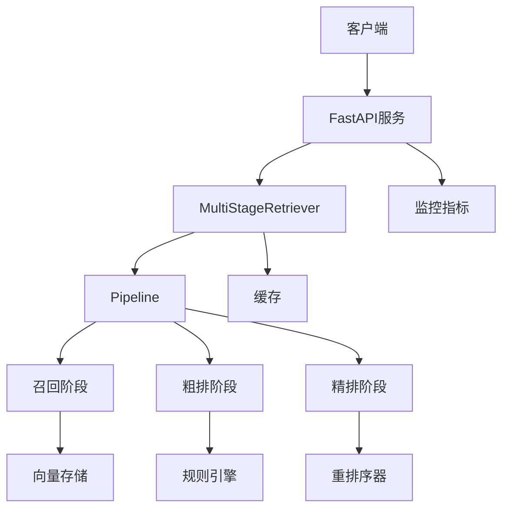

# MultiStage-RAG

## 项目介绍

MultiStage-RAG 是一个基于多阶段检索增强生成（RAG）的智能问答系统，采用模块化设计，支持三级检索流程（召回、粗排、精排），可灵活扩展和配置。

## 功能特性

### 核心功能
- **多阶段检索**：实现召回、粗排、精排三级检索流程
- **组件化设计**：支持插件式扩展，遵循开闭原则（OCP）
- **高性能缓存**：支持Redis、内存等多种缓存策略
- **可靠性保障**：内置熔断器机制，提供降级策略
- **灵活配置**：支持多环境配置，可通过YAML文件灵活调整
- **监控支持**：内置监控指标，方便系统运维

### 检索流程
1. **召回阶段**：使用向量检索，快速召回相关文档
2. **粗排阶段**：结合BM25算法和业务规则，初步筛选文档
3. **精排阶段**：使用重排序模型，精确排序文档

### 支持的组件
- **向量存储**：ChromaDB（默认）、FAISS
- **重排序器**：阿里百炼（默认）、BGE开源重排序器
- **规则引擎**：时效性规则、权威性规则、关键词规则、长度规则
- **缓存**：Redis（默认）、内存缓存、空缓存
- **LLM**：OpenAI、通义千问

## 技术栈

- **Python 3.9+**
- **FastAPI**：高性能Web框架
- **Asyncio**：异步编程支持
- **Pydantic**：数据验证和模型定义
- **LangChain**：LLM应用框架
- **ChromaDB**：向量数据库
- **Redis**：缓存数据库
- **FAISS**：高效向量检索

## 安装说明

### 1. 克隆仓库

```bash
git clone https://github.com/yourusername/MultiStage-RAG.git
cd MultiStage-RAG
```

### 2. 安装依赖

```bash
pip install -r requirements.txt
```

### 3. 配置环境

```bash
cp configs/default_config.yaml configs/development_config.yaml
# 根据实际情况修改配置文件
```

### 4. 启动服务

```bash
uvicorn multistage_rag.api.app:app --host 0.0.0.0 --port 8000 --reload
```

## 使用方法

### API接口

#### 检索接口

```bash
curl -X POST "http://localhost:8000/api/v1/retrieve" -H "Content-Type: application/json" -d '{"query": "你好", "top_k": 5}'
```

#### 添加文档

```bash
curl -X POST "http://localhost:8000/api/v1/documents" -H "Content-Type: application/json" -d '{"documents": [{"id": "1", "content": "这是一篇测试文档", "metadata": {"author": "test"}}]}'
```

### Python SDK

```python
from multistage_rag.core.retriever import MultiStageRetriever
import yaml

# 加载配置
with open("configs/default_config.yaml", "r") as f:
    config = yaml.safe_load(f)

# 初始化检索器
retriever = MultiStageRetriever(config)

# 执行检索
result = await retriever.retrieve("你好", top_k=5)
```

## 架构设计

### 系统架构图



### 核心组件

1. **MultiStageRetriever**：多阶段检索器，协调各检索阶段
2. **Pipeline**：检索管道，执行检索流程
3. **Stage**：检索阶段，包括召回、粗排、精排
4. **Component**：可插拔组件，支持多种实现
5. **Cache**：缓存机制，提高性能
6. **CircuitBreaker**：熔断器，保障系统可靠性

### 设计原则

- **开闭原则（OCP）**：通过工厂模式和策略模式，支持组件的灵活扩展
- **单一职责原则（SRP）**：每个组件只负责单一功能
- **依赖倒置原则（DIP）**：依赖抽象，不依赖具体实现
- **异步设计**：提高系统并发能力
- **容错设计**：内置熔断器和降级策略

## 配置说明

### 主要配置项

```yaml
# 检索配置
retrieval:
  enabled_stages:  # 启用的检索阶段
    recall: true
    pre_rank: true
    re_rank: true
  stage_params:  # 各阶段参数
    recall:
      top_k: 100
    pre_rank:
      top_k: 20
    re_rank:
      top_k: 5

# 向量存储配置
vector_store:
  type: chroma
  chroma:
    persist_directory: ./chroma_db
    embedding_model: all-MiniLM-L6-v2

# 重排序器配置
reranker:
  type: bailian
  bailian:
    api_key: your_bailian_api_key

# 缓存配置
cache:
  type: redis
  redis:
    host: localhost
    port: 6379
    db: 0

# LLM配置
llm:
  type: openai
  openai:
    api_key: your_openai_api_key
    model: gpt-3.5-turbo
```

## 扩展开发

### 添加自定义组件

1. **实现基类接口**：继承对应的基类，实现抽象方法
2. **注册组件**：在对应的工厂类中注册新组件
3. **配置使用**：在配置文件中指定使用新组件

### 示例：自定义重排序器

```python
from multistage_rag.components.reranker.base import BaseReranker
from typing import List
from ..models import Document

class CustomReranker(BaseReranker):
    def __init__(self, config):
        super().__init__(config)
        # 初始化自定义重排序器
    
    async def rerank(self, query: str, documents: List[Document], top_k: int = 5) -> List[Document]:
        # 实现重排序逻辑
        return sorted_documents
```

## 监控与运维

### 监控指标

- **检索延迟**：各阶段处理时间
- **缓存命中率**：缓存使用情况
- **检索成功率**：检索请求成功率
- **文档数量**：向量存储中的文档数量

### 日志配置

日志级别可通过配置文件调整，支持DEBUG、INFO、WARNING、ERROR、CRITICAL等级别。

## 性能优化

1. **调整检索阶段参数**：根据实际情况调整各阶段的top_k值
2. **启用缓存**：根据业务需求配置合适的缓存策略
3. **优化向量存储**：选择合适的向量存储和索引参数
4. **调整并发数**：根据服务器资源调整FastAPI的并发数

## 测试

### 单元测试

```bash
pytest tests/
```

### 性能测试

```bash
python scripts/benchmark.py
```

## 部署说明

### 开发环境

```bash
uvicorn multistage_rag.api.app:app --host 0.0.0.0 --port 8000 --reload
```

### 生产环境

```bash
# 使用gunicorn + uvicorn
gunicorn -w 4 -k uvicorn.workers.UvicornWorker multistage_rag.api.app:app --bind 0.0.0.0:8000

# 使用docker部署
docker build -t multistage-rag .
docker run -p 8000:8000 --env-file .env multistage-rag
```

## 贡献指南

1. Fork 仓库
2. 创建特性分支 (`git checkout -b feature/AmazingFeature`)
3. 提交更改 (`git commit -m 'Add some AmazingFeature'`)
4. 推送到分支 (`git push origin feature/AmazingFeature`)
5. 打开 Pull Request

## 许可证

本项目采用 Apache 2.0 许可证 - 查看 [LICENSE](LICENSE) 文件了解详情

## 联系方式

- 项目链接：https://github.com/yourusername/MultiStage-RAG
- 问题反馈：https://github.com/yourusername/MultiStage-RAG/issues

## 更新日志

### v1.0.0 (2024-12-03)

- 初始版本发布
- 实现多阶段检索流程
- 支持多种向量存储、重排序器、缓存和LLM
- 提供FastAPI接口
- 支持插件式扩展
- 内置监控和容错机制

---

**MultiStage-RAG** - 高效、灵活、可靠的多阶段检索增强生成系统

## 备注：目前属于第一次试验性版本，可能存在一些bug和性能问题。欢迎反馈和贡献。后面会继续优化和完善。
