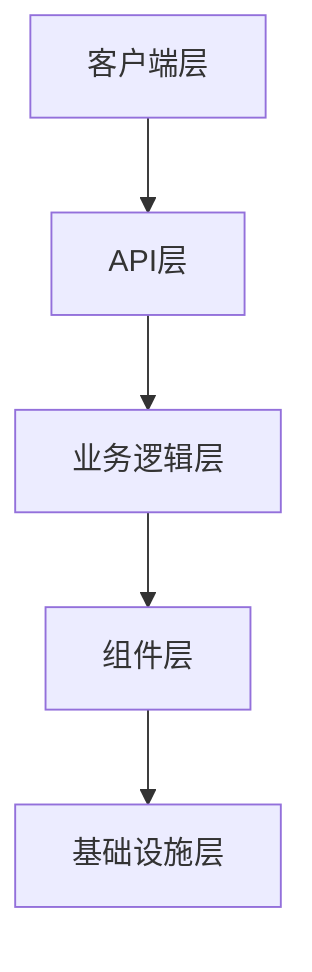
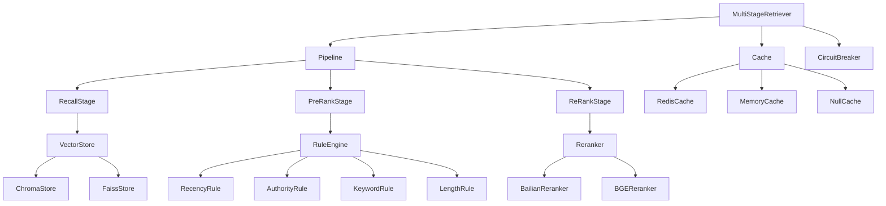
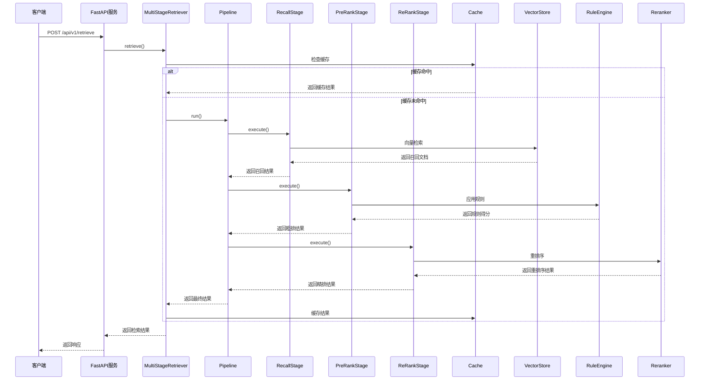
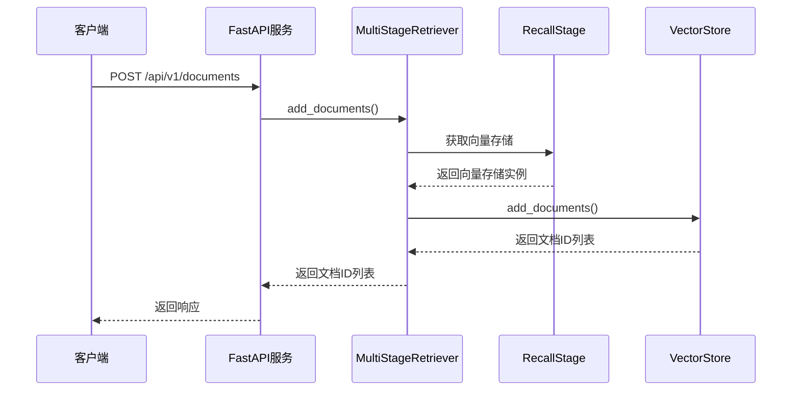
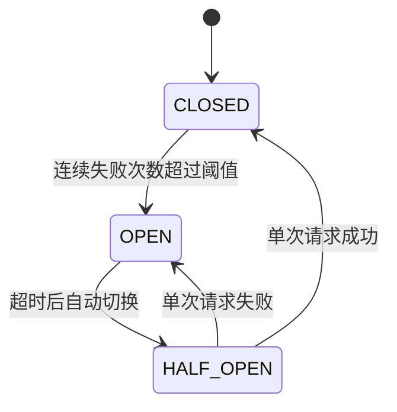
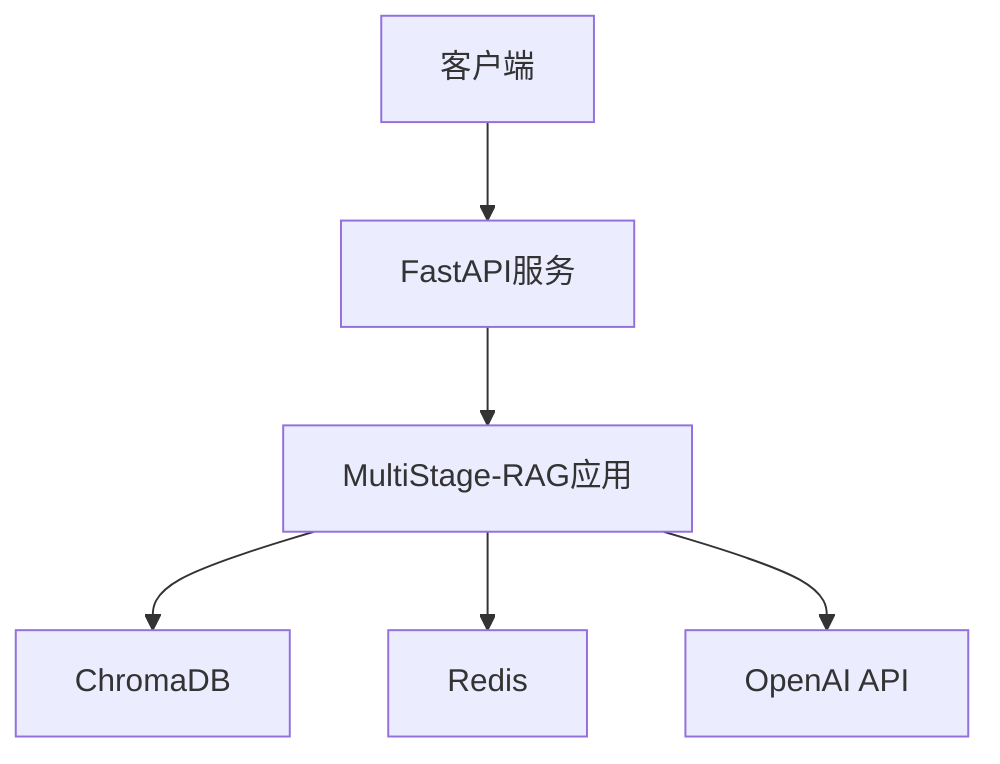
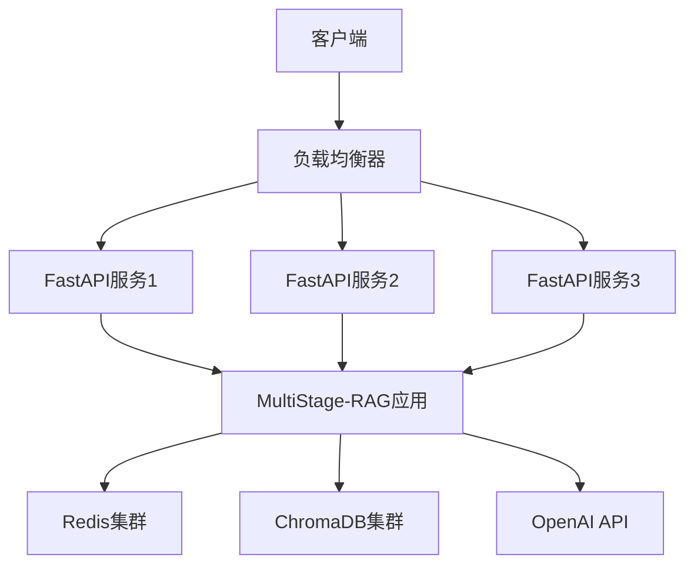

# MultiStage-RAG 架构设计说明

## 1. 架构概述

MultiStage-RAG 采用模块化、可扩展的架构设计，实现了三级检索流程（召回、粗排、精排），支持多种组件的灵活配置和扩展。系统基于异步编程模型，提供高性能的检索服务，同时内置可靠性保障机制。

### 1.1 架构目标

- **高性能**：支持高并发检索请求
- **可扩展**：支持插件式组件扩展
- **可靠性**：内置容错和降级机制
- **易用性**：提供简单易用的API接口
- **可配置**：支持灵活的配置调整

### 1.2 技术栈选择

| 类别 | 技术 | 版本 | 用途 |
|------|------|------|------|
| 编程语言 | Python | 3.9+ | 主要开发语言 |
| Web框架 | FastAPI | 0.100+ | 高性能Web服务 |
| 异步编程 | Asyncio | 内置 | 异步IO处理 |
| 数据验证 | Pydantic | 2.0+ | 数据模型和验证 |
| LLM框架 | LangChain | 0.3+ | LLM应用开发 |
| 向量存储 | ChromaDB | 0.5+ | 向量数据库（默认） |
| 向量存储 | FAISS | 1.7.4+ | 高效向量检索 |
| 缓存 | Redis | 4.6+ | 分布式缓存 |
| 配置管理 | Pydantic Settings | 2.0+ | 配置加载和验证 |

## 2. 系统分层

### 2.1 分层架构

系统采用分层架构设计，各层之间职责清晰，耦合度低，便于扩展和维护。



### 2.2 各层职责

| 层级 | 主要职责 | 核心组件 |
|------|----------|----------|
| 客户端层 | 发起检索请求，展示检索结果 | 前端应用、API客户端 |
| API层 | 处理HTTP请求，参数验证，响应返回 | FastAPI应用、路由处理器 |
| 业务逻辑层 | 实现检索业务逻辑，协调各组件 | MultiStageRetriever、Pipeline |
| 组件层 | 提供各种功能组件的实现 | 向量存储、重排序器、规则引擎、缓存、LLM |
| 基础设施层 | 提供底层支持 | 数据库、缓存服务、网络通信 |

## 3. 核心组件设计

### 3.1 组件关系图



### 3.2 核心组件详解

#### 3.2.1 MultiStageRetriever

**功能**：多阶段检索器，系统的核心组件，负责协调各检索阶段和组件。

**设计要点**：
- 采用工厂模式创建各组件实例
- 实现异步检索接口
- 内置缓存机制
- 内置熔断器，提供降级策略

**关键方法**：
- `retrieve()`：执行检索流程
- `add_documents()`：添加文档到向量存储
- `close()`：关闭资源

#### 3.2.2 Pipeline

**功能**：检索管道，负责执行检索流程，串联各个检索阶段。

**设计要点**：
- 支持动态启用/禁用各阶段
- 收集各阶段的执行指标
- 处理阶段执行异常

**关键方法**：
- `run()`：执行检索管道

#### 3.2.3 Stage

**功能**：检索阶段基类，定义了检索阶段的基本接口。

**子类实现**：
- **RecallStage**：召回阶段，使用向量检索快速召回相关文档
- **PreRankStage**：粗排阶段，结合BM25算法和业务规则筛选文档
- **ReRankStage**：精排阶段，使用重排序模型精确排序文档

**设计要点**：
- 采用抽象基类设计，支持多态
- 实现异步执行接口
- 收集执行指标

**关键方法**：
- `execute()`：执行阶段逻辑
- `run()`：执行阶段并收集指标

#### 3.2.4 Component

**功能**：可插拔组件，提供各种功能的具体实现。

**组件类型**：
- **VectorStore**：向量存储，支持ChromaDB和FAISS
- **Reranker**：重排序器，支持阿里百炼和BGE开源重排序器
- **RuleEngine**：规则引擎，支持多种业务规则
- **Cache**：缓存组件，支持Redis、内存和空缓存
- **LLM**：大语言模型，支持OpenAI和通义千问

**设计要点**：
- 采用工厂模式创建组件实例
- 实现统一的接口
- 支持配置驱动的组件选择

## 4. 数据流图

### 4.1 检索请求数据流



### 4.2 文档添加数据流



## 5. 设计原则

### 5.1 开闭原则（OCP）

系统采用工厂模式和策略模式，支持组件的灵活扩展，无需修改现有代码。新增组件只需实现相应的接口，并在工厂中注册即可。

### 5.2 单一职责原则（SRP）

每个组件只负责单一功能，职责清晰，便于维护和扩展。

### 5.3 依赖倒置原则（DIP）

系统依赖抽象接口，不依赖具体实现，降低了组件之间的耦合度。

### 5.4 接口隔离原则（ISP）

组件接口设计精简，只包含必要的方法，避免了不必要的依赖。

### 5.5 里氏替换原则（LSP）

子类可以无缝替换父类，系统运行时不会出现异常。

### 5.6 异步设计原则

系统采用异步编程模型，提高了并发处理能力，减少了线程阻塞。

## 6. 扩展性设计

### 6.1 组件扩展机制

系统支持通过以下方式扩展组件：

1. **实现接口**：继承相应的基类，实现抽象方法
2. **注册组件**：在工厂类中注册新组件
3. **配置使用**：在配置文件中指定使用新组件

### 6.2 示例：添加自定义重排序器

```python
# 1. 实现BaseReranker接口
class CustomReranker(BaseReranker):
    def __init__(self, config):
        super().__init__(config)
    
    async def rerank(self, query, documents, top_k=5):
        # 实现重排序逻辑
        return sorted_documents

# 2. 在RerankerFactory中注册
class RerankerFactory:
    @staticmethod
    def create(config):
        reranker_type = config.get("type", "bailian")
        if reranker_type == "custom":
            return CustomReranker(config.get(reranker_type, {}))
        # 其他组件注册...

# 3. 在配置文件中使用
reranker:
  type: custom
  custom:
    # 自定义配置
```

## 7. 可靠性设计

### 7.1 熔断器机制

系统内置熔断器，当某个组件出现故障时，自动切换到降级策略，避免故障扩散。



### 7.2 降级策略

当精排或粗排阶段失败时，系统自动降级到上一阶段的结果，确保服务可用性。

### 7.3 错误处理

系统对所有异常进行捕获和处理，返回友好的错误信息，同时记录详细的错误日志。

## 8. 性能设计

### 8.1 异步编程

系统采用异步编程模型，减少了线程阻塞，提高了并发处理能力。

### 8.2 缓存机制

系统支持多级缓存，包括：
- 检索结果缓存
- 组件级缓存（如重排序结果缓存）

缓存策略可通过配置文件调整，支持Redis和内存缓存。

### 8.3 批量处理

系统支持批量文档添加，减少网络开销，提高处理效率。

### 8.4 索引优化

向量存储采用高效的索引结构，支持快速的向量检索。

## 9. 安全设计

### 9.1 API安全

- 支持API密钥认证
- 支持请求速率限制
- 支持CORS配置

### 9.2 数据安全

- 敏感配置加密存储
- 支持HTTPS协议
- 数据传输加密

### 9.3 组件安全

- 组件间通信安全
- 第三方组件安全评估

## 10. 部署架构

### 10.1 单机部署

适用于开发和测试环境：



### 10.2 分布式部署

适用于生产环境：



## 11. 监控与运维

### 11.1 监控指标

系统收集以下监控指标：
- 检索延迟
- 缓存命中率
- 检索成功率
- 各阶段执行时间
- 组件调用次数
- 错误率

### 11.2 日志系统

系统支持多级日志记录，包括：
- 业务日志
- 错误日志
- 访问日志
- 性能日志

日志格式统一，便于日志分析和监控。

## 12. 总结

MultiStage-RAG 采用了模块化、可扩展的架构设计，实现了高性能、高可靠性的检索服务。系统支持多种组件的灵活配置和扩展，内置了可靠性保障机制，适合各种规模的部署环境。

通过遵循良好的设计原则和架构模式，系统具有良好的扩展性、可靠性和性能，能够满足不同场景的检索需求。